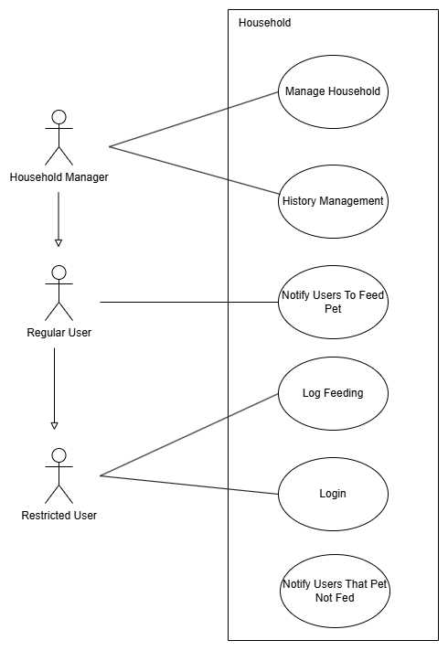
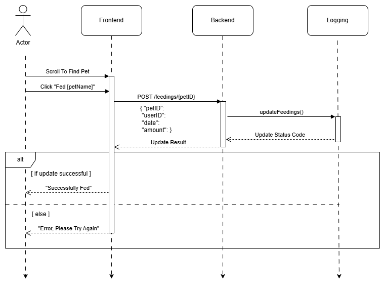

# M3 - Requirements and Design

## 1. Change History
<!-- Leave blank for M3 -->
1. **Reworked Interfaces (2025-03-03)**
    - Under **Designs Specification**, our old interfaces used java style formatting from frontend communication with the backend, when it should've been REST. These interfaces were converted to REST style. We also had to add/modify/remove some interfaces as we gained a better image of what it would take to actually implement them. There were many interfaces that we needed when coding that we did not account for in milestone 3 that have now been added. We also didn't consider the many different actions needed that become clear once coding.

2. **Added Contributions (2025-03-03)**
    - Under **Contributions**, added the contributions made towards completing milestone 4. Reformatted milestone 3 contributions to match the look.

3. **Small FR Edits (2025-03-19)**
    - Made small adjustments to the functional requirement wordings. Removed unecessary "scrolls", changed "main page" to "home page", added more details for clairity. Changed "Add User/Pet" to "New User/Pet". Updated the way to modify restriction level to match implementation, to allow for editing. All of these changes are for clairity.

4.  **NFR and numbering (2025-03-21)**
    - Adjusted the NFR and numbering of the failure scenarios based on TA feedback from M3

5.  **NFR Justification (2025-04-01)**
    - Added justifications for values in the NFRs based on TA feedback from M5

## 2. Project Description
“Did you feed the animals?” “Are the animals fed?” “Anyone feed the animals?” These texts flood the family group chat every day. The kids don’t respond. Mom is still at work. No one knows if the beasts have been fed. The beasts also lie, as though they are starving and wasting away even if they already got dinner. Many task managing apps out there are WAY too complicated. TAS is straightforward app that indicates whether or not your beloved household pet has been fed. To go even further, there will be a minimal mode, for those living with grandparents, small children, or a grumpy father that does not want to be bothered with a new app. Simple, easy, convenient. 

## 3. Requirements Specification
### **3.1. Use-Case Diagram**


### **3.2. Actors Description**
1. **Household Manager**:
   - Most technically capable user in the household
   - Initiates the household
   - Will control the users, permissions, pets, and feeding schedule
   - Also has access to all of the below
2. **Household Member/Regular User**:
   -   Average household member that will be able to feed the pet.
   -   Can request that another regular user feed the pet
   -   Receives notifications and feeding requests
3. **Restricted User**:
   - Household member who struggles with technology and needs/wants a limited UI
   - Can submit to the app when they’ve fed the pet
   - Can check the app to see whether they need to feed the pet or not

### **3.3. Functional Requirements**
<a name="fr1"></a>
1. **Log Feeding** 
    - **Overview**:
        1. Users must be able to log that a pet has been fed, ensuring accurate feeding records for tracking purposes.

    - **Detailed Flow for Each Independent Scenario**: 
        1. **Log Feeding Event**:
            - **Description**: Users log a feeding event by selecting the pet they’ve fed and confirming the action.
            - **Primary actor(s)**: All household member
            - **Main success scenario**:
                1. User scrolls through the list of pets on the base page to find the pet being fed.
                2. User presses the corresponding “Feed Pet” button to confirm that the pet has been fed.
                3. System updates the feeding log with the pet's ID, user ID, date, and amount of food.
                4. User is prompted with a success message indicating that the log has been updated successfully.
            - **Failure scenario(s)**:
                - 1a. App is unable retrieve the log data. 
                    - 1a1. User is redirected back to the home page and system displays an error message prompting the user to try again later.
                - 3a. App is unable to update the system
                    - 3a1. User is redirected back to the pet's page after the failure and prompted that the logging was unsuccesful and should try again.
                    - 3a2. User presses the “Feed Pet” button again to attempt logging the feeding once more
<a name="fr2"></a>

2. **Requesting Others to do Feeding** 
    - **Overview**:
        1. Regular users must be able to notify other regular users to feed the pet. The receiving user must be notified that they are responsible for feeding the pet.

    - **Detailed Flow for Each Independent Scenario**: 
        1. **Feeding Request Notification**:
            - **Description**: Users can send a notification to another user, requesting them to feed the pet. The receiving user is notified of their responsibility to feed the pet. 
            - **Primary actor(s)**: Household Manager, Regular User
            - **Main success scenario**:
                1. Sender begins at the home page and presses "Notify Other Users".
                2. The sender then presses the “Notify” button next to the name of the recipient.
                3. App sends a request to the server to notify the recipient.
                4. User 2 (the recipient) receives a notification indicating that they are responsible for feeding the pet.
            - **Failure scenario(s)**:
                - 3a. App is unable to send the request to the server.
                    - 3a1. System displays and error message prompting the user to try again later
                    - 3a2. User dismisses the message and is sent back to the home page to try again
<a name="fr3"></a>

3. **Managing The Household** 
    - **Overview**:
        1. Household Manager must be able to set up and edit the household users
        2. Household Manager must be abe to manage the pets and set their feeding schedules.

    - **Detailed Flow for Each Independent Scenario**: 
        1. **Add Users**:
            - **Description**: Household manager can add users to the household
            - **Primary actor(s)**: Household Manager
            - **Main success scenario**:
                1. Manager clicks the "Manage Household" button on the top of the page and is directed to a page with the "New User" button
                2. Manager is prompted to enter the name and email of the person they are inviting.
                3. Manger clicks "Add" 
                4. The server adds the user to the household 
                5. A toast message is displayed confirming that the user has been added
                6. Manager may edit the restriction level using the drop down
            - **Failure scenario(s)**:
                - 4a. The app is unable to update the server 
                    - 4a1. The app displays an error message and prompts the user with a message to try again
                    - 4a2. The input form is re-displayed, and the user types in the code again
                - 4b. The user does not exist
                    - 4b1. The app displays an error message saying that the user does not exist and should make sure they typed in the ID correct and the person has an account on the app
                    - 4b2. The user dismisses the message and is redirected back to the manage household page
        2. **Manage Pets**:
            - **Description**: Household manager can add pets and change their feeding schedules
            - **Primary actor(s)**: Household manager
            - **Main success scenario**:
                1. Manager clicks the "Manage Household" button on the top of the page and is directed to a page with the "New Pet" button
                2. Manager clicks the "New Pet" button and enters the pet name, feeding time, and pet type. 
                3. Manger clicks "Add" 
                4. The app updates the database with these changes
                5. A toast message is displayed confirming that the changes have been made
            - **Failure scenario(s)**:
                - 2a. Pets could not be retrieved
                    - 2a1. If there are no pets yet, display text saying "Add Your Pets!" in the text display. Otherwise, display "error getting pets, try again later"
                    - 2a2. The user backs out to the manage household screen and clicks manage pets to try again
                - 4a. The changes could not be made to the server
                    - 4a1. An error message is displayed and the user is prompted to try again
                    - 4a2. The user is directed back to the manage pets screen
<a name="fr4"></a>  

4. **History Management** 
    - **Overview**:
        1. Household Manager must be able to view the history of logs, including log time and log member.

    - **Detailed Flow for Each Independent Scenario**: 
        1. **Manage History**:
            - **Description**: 
            - **Primary actor(s)**: 
            - **Main success scenario**:
                1. Household Manager clicks the “View History” button on the main screen
                2. The history is retrieved and the user is directed to a new screen displaying the feeding history in the household
            - **Failure scenario(s)**:
                - 1a. User is not a Household Manager
                    - 1a1. User is not prompted with the "View History" button
                - 2a. Server is unable to retrieve the history
                    - 2a1. App displays an error message saying the history could not be retrieved and the user should try again later
                    - 2a2. The user backs out to the main screen and clicks the view history button again
<a name="fr5"></a>   

5. **Feeding Time Notification** 
    - **Overview**:
        1. User must receive a notification if it is time to feed the pet and the pet has not been fed.

    - **Detailed Flow for Each Independent Scenario**: 
        1. **Feeding Notification**:
            - **Description**: The system sends a time-based notification to users when it’s time to feed the pet, ensuring that pets are fed on schedule.
            - **Primary actor(s)**: Household Manager, Regular Users 
            - **Main success scenario**:
                1. The feeding schedule for the pet is triggered based on the time set by the user.
                2. The system sends a push notification to the user indicating that it is time to feed the pet.
                3. User receives the push notification on their device
            - **Failure scenario(s)**:
                - 2a. The push notification fails to send
                    - 2a1. The system fails to deliver the notification due to connectivity or server issues.
                    - 2a2. The next time the app is opened, the user is told the request was failed and is prompted to check their settings and permissions.
<a name="fr6"></a>

6. **Login Authentication** 
    - **Overview**:
        1. Users must be able to log in using Google authentication.

    - **Detailed Flow for Each Independent Scenario**: 
        1. **Login/Signup**:
            - **Description**: Users access the in-app account via their google account to gain access to the app
            - **Primary actor(s)**: All users
            - **Main success scenario**:
                1. User clicks the "Login Button"
                2. User is directed to the google authentication page
                3. If the user has an account, their household information is retrieved and they are sent to the main screen. Otherwise, if the user does not have an account, they are displayed a welcome message asking them to join or initiate a household.
            - **Failure scenario(s)**:
                - 2a. User is unable to authenticate through Google.
                    - 2a1. The app encounters an issue during the authentication process (e.g., incorrect credentials, server error)
                    - 2a2. The system displays an error message prompting the user to try again. 
                    - 2a3. The user dismisses the message and is redirected to the login screen
                - 3a. Household could not be initiated for a new user
                    - 3a1. The system displays an error message prompting the user to try again. 
                    - 3a2. The user dismisses the message and is redirected back to the welcome page
                

<!--### **3.4. Screen Mockups**-->


### **3.5. Non-Functional Requirements**
<a name="nfr1"></a>
1. **Accessibility**
    - **Description**: The app should be usable by all members of the household, including those with impaired vision, language barriers, and of all mental faculties. Further, users should be able to complete the core actions (logging a feeding, viewing history) in 3 clicks or less.
    - **Justification**: This app is designed for people who aren't tech-savvy. By making it simple and intuitive, we ensure it's easy for all users, regardless of ability, to track pet feedings with minimal effort. Core actions are streamlined to 3 clicks or less, eliminating complexity and making pet care accessible for everyone in the household. This limit of 3 clicks is a general rule first referenced by Jeffrey Zeldman in his book [Taking Your Talent to the Web 2001](https://zeldman.com/talent/Taking_Your_Talent_to_the_Web.pdf), saying "users should ideally be able to reach their intended destination within
three mouse clicks." While it may not be the end all be all, it is a sound guideline that we have chosen to follow.
<a name="nfr2"></a>    
2. **Ease of use**
    - **Description**: Requests made to the backend should be retrieved within 2 seconds with up to 100 concurrent users.
    - **Justification**: A key secondary function of any app is processing speed. Further since this is an app meant to speed up household work for the pets, it would be very problematic if the app caused more frustrations with slow API requests. The timing of 2 seconds is, again, a general rule for API calls, as referenced in [an article by OctoPerf](https://blog.octoperf.com/performance-response-times/#less-than-2-seconds), stating that "for complex activities, such as browsing products that vary along multiple dimensions, 2 seconds represents an important response-time limit," which is true of our database queries. In terms of the number of users, we feel that expecting a maximum of 100 concurrent users is reasonable considering our class size and is supported by [Blazemeter's bnechmark](https://help.blazemeter.com/docs/guide/performance-kpis-higher-number-concurrent-users.htm) for small scale applications.


## 4. Designs Specification
### **4.1. Main Components**
1. **User & Household Management Service**
    - **Purpose**: Manages user authentication (via Google API), household creation, and user roles. Ensures that users belong to a household before accessing pets and feeding logs. Separating user management from pet and feeding history ensures scalability and maintainability. Alternative being embedding user management in pet tracking would lead to tight coupling and harder role-based access control.
    - **Interfaces**: 

        1. ```POST /user/```
           - **Body**: { email, name, householdId }
           - **Purpose**: Adds a new user to a household.
        
        1. ```GET /user/:householdId```
           - **Purpose**: Returns all the users in a household.

        1. ```GET /user/specific-user/:email```
           - **Purpose**: Returns user object with specified email.

        1. ```PATCH /user/:email```
           - **Body**: Updates to make to user.
           - **Purpose**: Updates user object with specified email.

        1. ```DELETE /user/:email```
           - **Purpose**: Deletes user object with specified email.

        1. ```POST /household/create```
           - **Body**: { householdName, managerEmail }
           - **Purpose**: Creates a household with a specified manager.

        1. ```POST /household/add-user```
           - **Body**: { householdId, email }
           - **Purpose**: Adds specified email to a household.

        1. ```POST /household/remove-user```
           - **Body**: { householdId, email }
           - **Purpose**: Removes specified email to a household.

2. **Pet Management Service**
    - **Purpose**: Tracks pets in a household and their feeding schedules. Keeping pet data separate from user management allows for future expansions like health tracking. Merging it with user management would complicate database queries.
    - **Interfaces**: 
        1. ```POST /pet/```
           - **Body**: { name, householdId, feedingTime }
           - **Purpose**: Adds a new pet to a household with a specified name and feeding time.

        1. ```GET /pet/:householdId```
           - **Purpose**: Returns all the pets in a household.

        1. ```PATCH /pet/:petName/feed```
           - **Body**: { fed }
           - **Purpose**: Updates the status of a pet on if it's fed or not.

        1. ```DELETE /pet/:petName```
           - **Purpose**: Removes a pet from a household.

3. **Logging**
    - **Purpose**: Records and retrieves feeding history, ensuring users can check when and who last fed a pet. Keeping a dedicated feeding log service prevents bloating the pet management component. Embedding it in pet service would create unnecessary dependencies between pet data and feeding logs, and may lead to complications like calculations tied to the household rather than a specific pet.
    - **Interfaces**:
        1. ```POST /log/```
            - **Body**: { petId, userEmail, amount, householdId }
            - **Purpose**: Logs the fact that *user* fed *pet*, *amount* of food for each household.
        1. ```GET /log/pet/:petId```
            - **Purpose**: Gets the feeding history for a given pet.
        1. ```GET /log/household/:householdId```
            - **Purpose**: Gets the feeding history for a given household.
        1. ```GET /log/user/:userEmail```
            - **Purpose**: Gets the feeding history for a given user.
        1. ```GET /analytics/rankings/:householdId```
            - **Purpose**: Gets the rankings of users based off feeding contributions for a given household.
        1. ```POST /analytics/anomalies/:householdId```
            - **Purpose**: Detects anomalies in feeding behavior.
        
4. **Notifications**
    - **Purpose**: Sends reminders to users when pets need to be fed and alerts them when a feeding is logged, also users to send requests to other users. Implementing notifications with users directly would bloat the user component and unnecessarily tie mass notifications to individual users.
    - **Interfaces**: 
        1. ```POST /notify/:email```
           - **Purpose**: Notifies the user with specified email address to feed the animals.

### **4.2. Databases**  
1. **MongoDB (PetTrackerDB)**  
    - **Purpose**: Stores household information, users, pets, feeding history, and notification preferences.  
    - **Reason**: A NoSQL database provides flexibility for dynamic data structures (e.g., pets with different feeding schedules) and supports fast reads/writes, making it ideal for tracking events like feedings.  


### **4.3. External Modules**  
1. **Google OAuth 2.0**  
    - **Purpose**: Handles user authentication, allowing users to log in with their Google accounts securely.  
    - **Reason**: Reduces the need for custom authentication logic, ensuring security and ease of use.  

2. **Firebase Cloud Messaging (FCM)**  
    - **Purpose**: Sends push notifications to users for feeding reminders, missed feedings, and confirmations.  
    - **Reason**: Free for basic use, reliable, and integrates seamlessly with mobile apps.  

3. **Google Translate API**  
    - **Purpose**: Provides translation services for notifications and feeding logs to accommodate multilingual households.  
    - **Reason**: Supports real-time translations with a simple API call, making the app more accessible to families with non-English speakers.  


### **4.4. Frameworks**  
1. **Express.js (Node.js)**  
    - **Purpose**: Backend framework for handling API logic, database operations, and service orchestration.  
    - **Reason**: Express.js is lightweight and fast for handling RESTful APIs.  

2. **Docker**  
    - **Purpose**: Containerization of the backend and frontend services for consistent deployments.  
    - **Reason**: Ensures that the application runs the same way across different environments, making development and deployment easier.  

3. **AWS EC2**  
    - **Purpose**: Hosts the backend API and database services.  
    - **Reason**: Provides scalable infrastructure, integrates well with MongoDB and AWS services, and allows auto-scaling based on demand.  


### **4.5. Dependencies Diagram**


### **4.6. Functional Requirements Sequence Diagram**
1. [**Log Feeding**](#fr1)\
   
2. [**Requesting Others to do Feeding**](#fr2)\
   
3. [**Manage Household**](#fr3)\
   
4. [**History Management**](#fr4)\
   
5. [**Feeding Time Notification**](#fr5)\
   
6. [**Login Authentication**](#fr6)\
   


### **4.7. Non-Functional Requirements Design**
1. [**Accessibility**](#nfr1)
    - **Validation**: 
The app will support multiple languages, clear navigation, large readable fonts, high-contrast visuals, and intuitive icons to ensure accessibility for users with varying abilities. Any action that can be taken should take no more than 3 clicks.
2. [**Ease of Use**](#nfr2)
    - **Validation**: The app will have easy to access endpoints and optimized algorithms that allow up to 100 concurrent requests with response times below 2 seconds.
See 3.5 for justification of values.


### **4.8. Main Project Complexity Design**

**Feeding Data Analytics & Anomaly Detection System**  

- **Description**:  
  This system tracks pet feeding data, ranks users based on their monthly feeding contributions, and detects anomalies in pet feeding patterns. The algorithm processes feeding logs, pet profiles, and household data to identify significant deviations in feeding amounts as well as delays relative to scheduled feeding times.

- **Why complex?**:  
  - The algorithm involves **nested loops** for per-pet anomaly detection and per-user ranking aggregation.  
  - Uses a **dynamic deviation threshold** (30% of the average feeding amount) to determine if a feeding event is abnormal.  
  - Implements **late feeding detection** by comparing the actual feeding timestamp (adjusted to a specific time zone) against a scheduled feeding time with a 30-minute tolerance.  
  - Integrates multiple data sources (feeding logs, pet profiles, household data) and performs multi-step computations for both anomaly detection and user ranking calculations.

- **Design**:  
    - **Input**:  
      - **Feeding Log Data**:  
        - `Household ID`  
        - `Pet name`  
        - `User name` (who fed the pet)  
        - `Amount of food fed (grams)`  
        - `Timestamp of feeding`  
      - **Pet Data**:  
        - `Pet name`  
        - `Feeding time` (scheduled time, e.g., "10:00")  
        - `Household ID`  
      - **Household Data**:  
        - `Household ID`  
        - Additional household-related details  
    - **Output**:  
      - **Feeding Anomalies** for each pet:  
         - `Large Deviation`: Boolean flag indicating if any feeding amount deviates by more than 30% from the average feeding amount.  
         - `Significantly Late`: Boolean flag indicating if any feeding occurred more than 30 minutes after the scheduled time.  
         - `Average Amount`: The computed average feeding amount.  
         - `Feeding Count`: Number of feeding events recorded in the past week.  
      - **User Rankings**: A sorted list of users with their contribution percentage relative to the total feeding amount for the current month.

    - **Main Computational Logic**:  
      1. **Retrieve Data**:  
         - Fetch household details, pet profiles, and feeding logs (from the past week for anomaly detection and the current month for ranking calculations).  
      2. **Anomaly Detection**:  
         - For each pet in the household:  
           - Filter logs from the past week associated with that pet.  
           - Calculate the average feeding amount and set a deviation threshold at 30% of this average.  
           - For each log:  
             - Flag a **large deviation** if the log’s feeding amount differs from the average by more than the threshold.  
             - Convert the log’s timestamp to the target time zone (e.g., Vancouver time) and compare it with the scheduled feeding time; flag the feeding as **significantly late** if the delay exceeds 30 minutes.  
      3. **User Rankings Calculation**:  
         - Aggregate feeding amounts per user over the current month.  
         - Calculate each user’s contribution percentage relative to the overall feeding total and sort the results in descending order.

    - **Pseudo-code**:  
        ```
        # Step 1: Data Retrieval
        Retrieve household, pet, and feeding log data.
        Define oneWeekAgo as current date minus 7 days.
        Define startOfMonth and startOfNextMonth for ranking calculation.
        
        # Step 2: Anomaly Detection per Pet
        For each pet in the household:
            Filter logs for the pet from the past week.
            If logs exist:
                Sum feeding amounts and calculate average.
                Set deviationThreshold = average * 0.3.
                For each log:
                    If |log.amount - average| > deviationThreshold:
                        Mark largeDeviation = true.
                    Convert log.timestamp to target time zone.
                    Set scheduledDate based on pet.feedingTime.
                    If (log timestamp - scheduledDate) > 30 minutes:
                        Mark significantlyLate = true.
                Record anomaly details for the pet.
            Else:
                Record anomaly with largeDeviation = false, significantlyLate = false, averageAmount = 0, feedingCount = 0.
        
        # Step 3: User Rankings Calculation
        Retrieve logs for the current month.
        If logs exist:
            For each log:
                Aggregate feeding amounts by user.
            Compute overall total feeding amount.
            For each user:
                Calculate contribution = (user total / overall total) * 100.
            Sort rankings by contribution descending.
        Else:
            Return empty rankings.
        
        # Output results:
        Return anomalies and user rankings.
        ```

## 5. Contributions
### **Milestone 3**
- **Tjammie Ko *(14 hours)***: Sequence Diagrams, Formatting, Other
- **Dean McCarthy *(7 hours)***: Functional Requirements, Actors, Other
- **Aidan Cotsakis *(8 hours)***: Presentation, Reflections, Other
- **Matthew Fung *(16 hours)***: MD File, Functional Requirements, Dependency Diagram, Other

### **Milestone 4**
- **Tjammie Ko *(40 hours)***:
Created the majority of the frontend interface,
created pages for managing households, feeding pets, making new households, viewing logs, and more,
worked on getting frontend to communicate with backend,
other.
- **Dean McCarthy *(35 hours)***:
Worked on various aspects of frontend and backend code,
created UI to add pets,
handled managing users on the front and back end,
smart notifications,
other.
- **Aidan Cotsakis *(30 hours)***:
Setup User authentication,
updated Documentation,
wrote Reflections,
modified Various UI components,
other.
- **Matthew Fung *(40 hours)***:
Created the majority of the backend,
worked on deploying server,
created notification system,
implemented main complexity,
added endpoints for users, pets, households, and more,
looked into https communication,
other.
